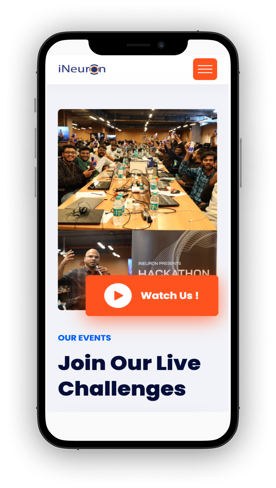

## iNeuron Website (Landing Page)
---

> [Demo](https://ineuronweb.vercel.app)

Hi folks 👋🏻
This is a Landing Page for iNeuron.ai made during hackathon conducted in full Stack web development course.
I have learned many new things during this hackathon like how to make website responsive , animations , swipper effects etc.
Thankyou `Hitesh Choudhary` for pushing me hard so that we can know our potential. 

Although I wanted to make this page using React and Tailwind but I thought just now in the course I have leared `HTML` and `CSS` so, why not to create a webiste using just `HTML` and `CSS` and yeh! on top of it I have added few animations to make it look little more attrective. 

### Tech Used :
---
 `HTML`

 `CSS`

 `JavaScript`

### Mockups
---
 
 

